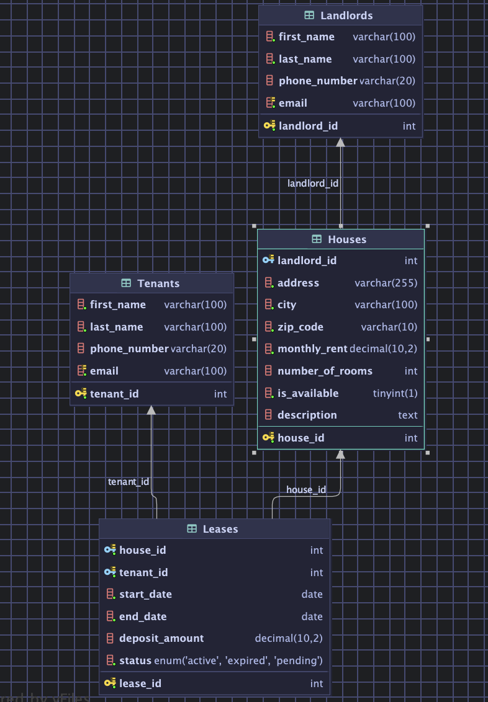

# Rental House Management System

### 1. Veritabanı Kurulumu (Docker Kullanarak)
Projenin veritabanı bağımlılığını (MySQL) başlatmak için projenin ana dizininde aşağıdaki komutu çalıştırın:
```bash
docker compose up -d
```

### 2. Uygulamayı Çalıştırma
Projeyi derlemek ve çalıştırmak için:
```bash
./mvnw spring-boot:run
```

Uygulama varsayılan olarak `http://localhost:8080` adresinde çalışacaktır.

### 3. Web Arayüzü
Proje, tüm veritabanı işlemlerini test etmek için modern bir web arayüzü içermektedir. 

#### Özellikler:
- **4 Ana Modül**: Kiracılar, Ev Sahipleri, Evler ve Kiralamalar için ayrı yönetim panelleri
- **Tam CRUD İşlemleri**: Tüm modüller için oluşturma, okuma, güncelleme ve silme işlemleri
- **Kiralama Yönetimi**: Yeni kiralama başlatma ve aktif kiralamaları sonlandırma
- **Dinamik Formlar**: Modal tabanlı kullanıcı dostu formlar
- **Gerçek Zamanlı Güncellemeler**: İşlem sonrası otomatik liste yenileme
- **Responsive Tasarım**: Mobil ve masaüstü uyumlu modern arayüz

#### Kullanım:
Uygulama çalışırken tarayıcınızda şu adrese gidin:
```
http://localhost:8080
```

Web arayüzü tüm REST API endpoint'lerini kullanarak veritabanı işlemlerini gerçekleştirir. Swagger UI dokümantasyonuna erişmek için:
```
http://localhost:8080/swagger-ui/index.html
```

## Database Scheme



### 4. Database Schema (CREATE TABLE Scripts)

#### House
```sql
CREATE TABLE IF NOT EXISTS Houses (" +
                    "    house_id INT AUTO_INCREMENT PRIMARY KEY," +
                    "    landlord_id INT," +
                    "    address VARCHAR(255) NOT NULL," +
                    "    city VARCHAR(100) NOT NULL," +
                    "    zip_code VARCHAR(10) NOT NULL," +
                    "    monthly_rent DECIMAL(10, 2) NOT NULL," +
                    "    number_of_rooms INT," +
                    "    is_available BOOLEAN NOT NULL DEFAULT TRUE," +
                    "    description TEXT," +
                    "    FOREIGN KEY (landlord_id) REFERENCES Landlords(landlord_id)" +
                    ")
```

#### Landlord
```sql
CREATE TABLE IF NOT EXISTS Landlords (" +
                    "    landlord_id INT AUTO_INCREMENT PRIMARY KEY," +
                    "    first_name VARCHAR(100) NOT NULL," +
                    "    last_name VARCHAR(100) NOT NULL," +
                    "    phone_number VARCHAR(20)," +
                    "    email VARCHAR(100) UNIQUE NOT NULL" +
                    ")
```

#### Tenant
```sql
CREATE TABLE IF NOT EXISTS Tenants (" +
                    "    tenant_id INT AUTO_INCREMENT PRIMARY KEY," +
                    "    first_name VARCHAR(100) NOT NULL," +
                    "    last_name VARCHAR(100) NOT NULL," +
                    "    phone_number VARCHAR(20)," +
                    "    email VARCHAR(100) UNIQUE NOT NULL" +
                    ")
```

#### LEASE
```sql
CREATE TABLE IF NOT EXISTS Leases (" +
                    "    lease_id INT AUTO_INCREMENT PRIMARY KEY," +
                    "    house_id INT NOT NULL," +
                    "    tenant_id INT NOT NULL," +
                    "    start_date DATE NOT NULL," +
                    "    end_date DATE NOT NULL," +
                    "    deposit_amount DECIMAL(10, 2)," +
                    "    status ENUM('ACTIVE', 'EXPIRED', 'PENDING') NOT NULL," +
                    "    FOREIGN KEY (house_id) REFERENCES Houses(house_id)," +
                    "    FOREIGN KEY (tenant_id) REFERENCES Tenants(tenant_id)" +
                    ")
```


### 5. Database Operations Scripts
#### Houses
```sql
INSERT INTO Houses (landlord_id, address, city, zip_code, monthly_rent, number_of_rooms, is_available, description) VALUES (?, ?, ?, ?, ?, ?, ?, ?)
SELECT * FROM Houses WHERE house_id = ?
SELECT * FROM Houses
UPDATE Houses SET landlord_id = ?, address = ?, city = ?, zip_code = ?, monthly_rent = ?, number_of_rooms = ?, is_available = ?, description = ? WHERE house_id = ?
DELETE FROM Houses WHERE house_id = ?
```

#### Landlord
```sql
INSERT INTO Landlords (first_name, last_name, phone_number, email) VALUES (?, ?, ?, ?)
SELECT * FROM Landlords WHERE landlord_id = ?
SELECT * FROM Landlords
UPDATE Landlords SET first_name = ?, last_name = ?, phone_number = ?, email = ? WHERE landlord_id = ?
DELETE FROM Landlords WHERE landlord_id = ?
```

#### Lease
```sql
INSERT INTO Leases (house_id, tenant_id, start_date, end_date, deposit_amount, status) VALUES (?, ?, ?, ?, ?, ?)
SELECT * FROM Leases WHERE lease_id = ?
SELECT * FROM Leases
UPDATE Leases SET house_id = ?, tenant_id = ?, start_date = ?, end_date = ?, deposit_amount = ?, status = ? WHERE lease_id = ?
DELETE FROM Leases WHERE lease_id = ?
SELECT * FROM Leases WHERE house_id = ? AND status = 'ACTIVE' AND end_date >= CURRENT_DATE()
```

